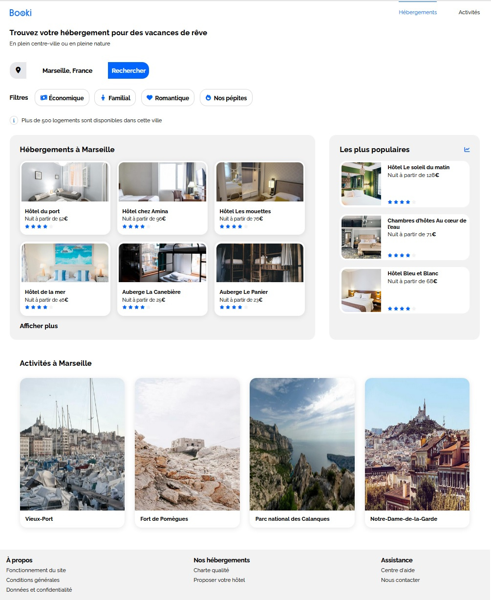

# 🌟 Projet 02 - Booki

## 📖 Présentation

**Booki** est un projet de site web permettant aux utilisateurs de trouver des **hébergements** et des **activités** dans la ville de leur choix.

Ce projet est réalisé dans le cadre d'une alternance en tant que **développeur web** au sein de la start-up *Booki*.

> L'objectif principal est d'intégrer l'interface du site à l’aide de **HTML** et **CSS**, en suivant les maquettes fournies par l’UI designer **Loïc**. L’interface devra être **responsive** et compatible avec les différents supports *(desktop, tablette, mobile)*.

---


## 🗂️ Structure du Projet
```
Projet-02-Booki/
├── index.html # Fichier principal
├── css/
│ └── style.css # Fichier CSS principal
├── images/ # Dossier pour les images
└── README.md # Présentation du projet

```

## 🚀 Fonctionnalités

- Affichage des hébergements disponibles par ville
- Affichage des activités proposées par ville
- Interface claire et responsive
- Recherche par filtres
- Header avec navigation
- Footer avec informations utiles

---

## 🔧 Technologies Utilisées

- HTML
- CSS
- Flexbox
- Responsive Design

---

## 📝 Validation

Pour garantir la qualité du code, nous utilisons les validateurs W3C :

- [Validateur HTML](https://validator.w3.org/)
- [Validateur CSS](https://jigsaw.w3.org/css-validator/)

---

## ⚙️ Installation

1. Cloner le dépôt GitHub :

   ```bash
   git clone https://github.com/MTDev2024/Projet-02-Booki.git

2. Ouvrir le fichier index.html dans votre navigateur.

Le site est visible [ici](https://mtdev2024.github.io/Booki/)

```